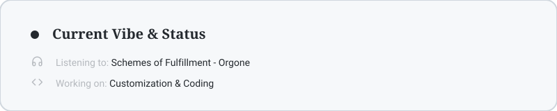

  <picture>
    <source media="(prefers-color-scheme: dark)" srcset="./background-2.jpg">
    <source media="(prefers-color-scheme: light)" srcset="https://i.pinimg.com/1200x/59/6b/2f/596b2f17146169cdedb8a83237811ee9.jpg">
    
  </picture>

  <picture>
    <source media="(prefers-color-scheme: dark)" srcset="./line-black.svg">
    <source media="(prefers-color-scheme: light)" srcset="./line-whitee.svg">
    
  </picture>

  <picture>
    <source media="(prefers-color-scheme: dark)" srcset="./title-vbl.svg">
    <source media="(prefers-color-scheme: light)" srcset="./title-vwh.svg">
    
  </picture>

  <picture>
    <source media="(prefers-color-scheme: dark)" srcset="./line-black.svg">
    <source media="(prefers-color-scheme: light)" srcset="./line-whitee.svg">
    
  </picture>

  <picture>
    <source media="(prefers-color-scheme: dark)" srcset="https://github-readme-activity-graph.vercel.app/graph?username=wasteodd&theme=react-dark&hide_border=true&color=ffffff&line=ffffff&point=ffffff">
    <source media="(prefers-color-scheme: light)" srcset="https://github-readme-activity-graph.vercel.app/graph?username=wasteodd&theme=default&hide_border=true&color=24292e&line=24292e&point=24292e">
    
  </picture>

  <picture>
    <source media="(prefers-color-scheme: dark)" srcset="./status-dark.svg">
    <source media="(prefers-color-scheme: light)" srcset="./status-lightt.svg">
    
  </picture>

